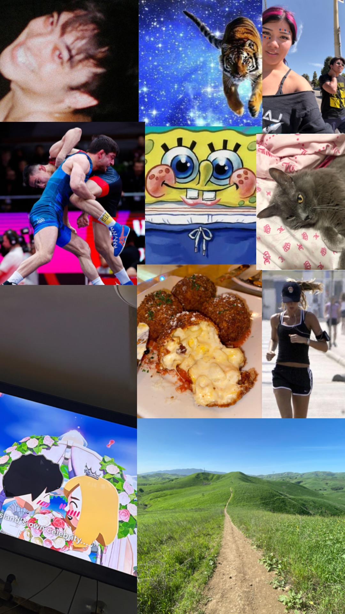

# me-in-markdown
## Letter to Mr. Aiello!
Hello, Mr. Aiello. My name is **Lina Santana** and I am currently in 12th grade. A little bit about me is that I have 2 siblings and 4 pets (1 cat and 3 dogs, all boys!). I also am apart of the Chatsworth Cross Country and Wrestling team. My favorite movie is Requiem for a Dream which is about 4 people who struggle with `addiction` and really goes into detail about how addiction can ruin your life by showing realistic scenes of withdrawal and the drive to get your hands on substances. Although it does sound very dark, I liked it because it brings awareness about addiction and overall was unpredictable which made me more engaged and intrigued. Last school year I was enrolled in `AP Language and Composition` and learned the skill of being able to write an essay under pressure and with a certain time limit. By doing so, it made me <u>more confident in my writing and my ability to think fast and structure what I'm going to write without becoming stressed.</u> A personal achievement I reached was placing at cities for wrestling. It is a big tournament and freshman year I didn't place in any tournaments and sophomore year I wanted to make a comeback. I placed 3rd in regionals which allowed me to qualify for cities and at cities I placed 6th. 

Alongside that, I also like to go on hikes every saturday with my Mom. We've gone on hikes as long as 6 miles and ones as short as 1 mile. Speaking of, next saturday we are planning on hiking the Santa Paula Punch Bowls and swimming in the water. My brother went there recently with his friends and complained about how gruesome the hike was. That being said, he stated that me and my Mom *wouldn't be able to handle it* and that it's so much `worse` than expected. This is what motivated me and my Mom to go there and complete the hike, just to prove to him that it is possible. Besides that, my favorite hike is at the Chino Hills State Park which has multiple routes inside it. I went on the 3 mile hike and although it was very steep, the destination was very enjoyable! The weather was sunny but with wind which made it much easier, and all around was greenery instead of the dead grass that's normally around!

## Recent Repeats
During all these hikes, I like to listen to music to drown out any loud breathing of mine or any unpleasant noises I hear. Overall, it helps me not realize how hard the hike is because I begin to daydream! That being said, I made a playlist of some of the songs I've had on repeat recently and a little taste of the kind of music I'm into. I'd say my music taste is a little over the place but I mostly listen to pop and indie music! I think of music as a little way to relax and decompress from any worries or stress that has accumulated. My favorite artists are Beach House, Steve Lacy, and The Marias while my all time favorite song is Slow Dancing in the Dark by Joji. I love Joji's songs but I wouldn't consider him my favorite artist. However, slow dancing in the dark has been my favorite song since 2022 and I haven't gotten bored of it yet! 

 ## HYPERLINK (RECENT REPEATS)
  [ This is a hyperlink to Spotify ](https://open.spotify.com/playlist/2tPDP6BQUwPHxzHxWFIoSl?si=7b3b7c8948ca46b5)

  #  FAV THINGS !!
  As much as I love to go on hikes and train for my sports, eating is a big reward after training. Although I don't go very often, Cheesecake Factory has become one of my favorite places to eat at because of their appetizers, the `Mac and Cheese Balls`. They are essentially balls with breadcrumbs around and inside is a gooey mac n cheese that tastes absolutely delicious! At the bottom of the plate is marinara sauce to dip them in and enjoy! My favorite animal is a tiger because of their unique appearance and just how assertive they are! I always grew up watching spongebob, so it's no surprise to me that it's my favorite show *(its also my senior backpack!)* I do watch lots of anime but I don't really speak much about it because not many people I know watch it. However, over the last couple of months I've been reading/watching Jojo's Bizarre Adventure and it has truly become one of my favorites! The grey cat is Pancakes who I've had since I was 4 years old, making him 13 years old today! I also included a real photo from my Chino Hills hike on the bottom right, and in the top right is a photo of me and my friend during cross country practice `(not very fun)`. At the bottom left is my current obsession which is the new Tomodachi Life game! It has been so much fun making my friends and seeing how their lives are in the game world and seeing how each story turns out!
  

# *Some* Goals I want to reach this 2026-2027 school year!
Goals I want to reach to better myself and improve my quality of life!
  # 2026-2027 GOALS
  - Pass all my AP tests
  - Improve my running skills
  - Improve my wrestling skills
  - Improve my sleep schedule
  - Journal my thoughts more